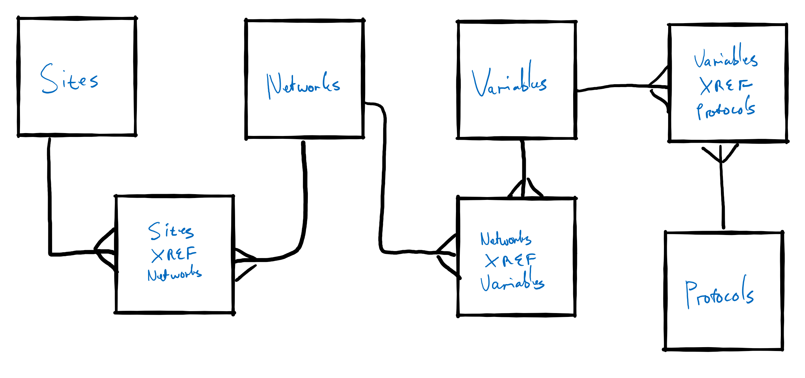

<!--- This file is automatically generated. Dont edit! -->
# SEACRIFOG
This is a tool for exploring the inventory of carbon-related observation infrastructure. There are numerous metadata repositories describing, and linking to, datasets related to carbon measurement in some way or another. These datasets are rich, but not easily discovered by existing search tools such as Google Search. 

The prototype (currently available at https://seacrifog.saeon.ac.za) is aimed at providing an interactive overview of the infrastructure that supports carbon measurements. Users can select/deselect various elements of the carbon observation infrastructure, which serves the dual purpose of providing detailed information on individual, selected components of the system, and also constraining search criteria that can be applied against various organizations’ metadata repositories across the world (providing these organizations make their repositories electronically searchable, which many do).

The prototype consists of a pair of software applications:

- A long running HTTP server that provides a publicly available API for interacting with the data representing the carbon observation platform model, and that acts as an adapter for specifying metadata-searches constrained by some selection of the platform entities
- A browser client (website) that provides a richly interactive UI for interacting with the API. 

The browser client is tightly coupled with the API logic. The API, however, can stand as a useful publicly available service in it’s own right.

# Tech stack
- Database
  - PostGIS
- API
  - Node.js (server-side JavaScript framework)
  - Express (web application framework)
  - GraphQL (express-graphql)
  - Node Postgres (database adapter)
- Browser client
  - ESNext (Babel, Webpack precompilation and bundling)
  - React
  - Apollo Client (GraphQL provider)
  - React-MD (MIT licensed Material Design component library implementation)

# Data model


# API
- [API documentation](http://api.seacrifog.saeon.ac.za "API Documentation")
- [Interactive API Explorer](https://api.seacrifog.saeon.ac.za/graphiql "GraphiQL")
- [GraphQL endpoint](http://api.seacrifog.saeon.ac.za/graphql "API Endpoint")

# Client
The client currently deployed at [seacrifog.saeon.ac.za](http://seacrifog.saeon.ac.za/graphql "SEACRIFOG Work package 5.4 deliverable deployment on SAEON's infrastructure") as an SPA (Single Page Application), such is typical of React.js client apps. Architecturally, the client is organized conceptually of 'pages', each page comprising one or more 'modules'. Observational infrastructure is organized according to entity 'class'. For each entity class there is a page that lists all entities of that type (a list/explorer page), and an overview page that allows for seeing and editing a single entity. For example, all the entities of type `Variable` can be found on the HTTP path `/variables`, listed and searcheable in a table. A single variable can be viewed and edited on the `/variable/:id` path. There is an exception - the `/sites` route displays a map of sites, along with proof-of-concept visualization charts. Individual sites can be edited on the `/networks/:id` path (sites of a particular network can be edited). Below is a representation of the site map:

```
.
├── /sites
├── /networks
│   └── /networks/:id
├── /variables
│   └── /variables/:id
├── /protocols
│   └── /protocols/:id
└── /search-results
```

## Modules
Several modules are used on multiple pages. These include:

### Global state managment & Search module
State is managed in three ways across the application:

- Locally: state that is localized to individual components is achieved via stateful component ([class components](https://reactjs.org/docs/state-and-lifecycle.html)) or by using the newer[React Hooks API](https://reactjs.org/docs/hooks-state.html)
- Explicity: Stateful contexts are typically provided across groups of components via well-known React architectural patterns including [explicitly passing props down component trees](https://reactjs.org/docs/composition-vs-inheritance.html), or the [render props pattern](https://reactjs.org/docs/render-props.html)
- Globally via the [context API](https://reactjs.org/docs/context.html)

A single global state module is used to keep track of user interactions across the app (selecting/deselecting of items). As entities are toggled a background search is performed for all currently selected search critera - the results are stored in client memory.

### Atlas
The map is provided by OpenLayers 6, utilizing an API provided by a thin React.js wrapper library - [@saeon/ol-react](https://www.npmjs.com/package/@saeon/ol-react "React OL Wrapper library") - authored by SAEON (at the time of writing there are no well-maintained OpenLayers 6 React.js wrapping libraries) and made available as MIT-licensed open source code. OpenLayers in the context of a JavaScript application is just a single object `olMap`. This object keeps it's own internal state and handles interactions internally. The `@saeon/ol-react` wrapper layer essentially provides the means of mapping React state to `olMap` internal state. This is achieved via using the [ECMAScript Proxy objects API](https://developer.mozilla.org/en-US/docs/Web/JavaScript/Reference/Global_Objects/Proxy). Note that this is incompatible with Internet Explorer, and not possible to polyfill. This tool as it currently exists should, however, work on Internet Explorer 11 and upwwards only because no advanced layer management is used. This will obviously not be the case with further development. In addition to the layer proxy, the Atlas module provides a means of selecting/deselecting map features, and also for specifying layers.

### Reuseable components
For the most part, components are used directly as provided by the React-MD library - already a significant amount of work in terms of crafting reuseable components! However there are a few cases in this UI that 'grouped element trees' are reused in multiple places throughout the application. These include

#### A Table
Tables are required on all the list/explorer pages, and some of the item/edit pages. A reuseable table that supportes searching, sorting, and selecting is provided as generalized [React-MD-based component](client/src/modules/shared-components/_table.jsx) with a simple signature to faciliate reuse: 

```jsx
<Table
  actions={[...]}
  searchbar={true}
  defaultPaginationRows={5}
  selectedIds={[...]}
  dataDefinitions={{...}}
  data={[...]}
  toggleSelect={callback}
/>
```

Other reuseable components

### Edit form
Typically web forms are binded to some model - often referred to as 'form model binding'. This conceptually allows for representation of some table/object state as an appropriate input field. Similarly, this concept is utilized in SEACRIFOG. All the edit pages make use of UI logic to draw editble forms from JavaScript object (and provide a means of saving them to the database via GraphQL mutations). code for files that together comprise this module can be found [here](client/src/modules/editor-page/)

### DropdownSelect
A simple component to show a filterable list of items that can be selected/deselcted. Lists are ideally rendered via 'virtualized windows' in React when there are lots of items, as can happen in this case. The component is available [here](client/src/modules/shared-components/_dropdown-select.jsx).

### Side filter module
A module that combines many instances of the `DropdownSelect` reuseable componet, along with controlling callbacks to update the global state module. Found [here](client/src/modules/shared-components/_side-menu-filter.jsx). This component is used on most pages - it provides direct access to the the current global state in terms of what is being filtered.

## Page Types
### `/sites` page
The map is interactive in that it allows for assessing which variables are measured at which sites (or groups of sites) - this is achieved by clicking features on the atlas, that will both add selected sites to the metadata filter, and trigger charts (provided by `eCharts`) to display.

### List/explorer pages (`/networks`, `/variables`, `/protocols`)

# Current deployment (25-02-2020)
- PostGIS: Served via a Docker container (mdillon/postgis Docker image)
- API: Docker container (refer to the Dockerfile in the source code)
- Browser client: Docker container (refer to the Dockerfile in the source code)
- Server: Single CentOS 7 virtual machine (2 cores, 2GB RAM, 60GB)

# API Documentation

## Quickstart (local dev environment)

**Start a PostGIS server**
```sh
docker run -p 5432:5432 --name postgis -v postgres11:/var/lib/postgresql/data -e POSTGRES_PASSWORD=password -d mdillon/postgis
```

**Setup the DB**
The .backup file is from an older version of PostgreSQL and some PostgreSQL clients don't read it as a result. Dbeaver - a decent, free DB IDE - has a PostgreSQL client that works by default, but any PostgreSQL client should work).

1. Log into a running PostGIS server
2. Create a DB called `seacrifog_old`
3. Restore ([seacrifog-prototype.backup](api/src/db)) to this database. It's located in this repository at `api/src/db/`

Once the `seacrifog_old` backup is restored, on application startup a new database will be initialized (`seacrifog`). The old data will be migrated to a new schema and the CSVs located in `api/src/db/csvs` will be imported as well. These are dummy data that are the result of work outputs prior to Workpackage 5.4.

**Install Node.js dependencies**
```sh
npm install
```

**Configure the API to re-create the database on startup**
This is false by default (for obvious reasons!)
```sh
echo FORCE_DB_RESET=true > .env
```

**Start the API**
```sh
npm start
```
The application should be listening for connections on `http://localhost:3000`. 

## Setup production environment
1. Configure a Postgis database server somewhere
2. The application reads a `.env` file located at `api/.env` on startup. So to configure the API, as part of the deployment process create such a file and populate it with production-sensible values (refer to notes below on "Configuration")
3. Start the app: `npm run start:prod`

## Configuration
This is a sample of the environment variables that the app requires to run - specifically in the context of a `.env` file (with the default values shown).

**Example `.env` file with defaults**
```
PORT=3000
ALLOWED_ORIGINS=http://localhost:3000,http://localhost:3001
POSTGRES_HOST=localhost
POSTGRES_USER=postgres
POSTGRES_DATABASE=seacrifog
POSTGRES_PASSWORD=password
POSTGRES_PORT=5432
FORCE_DB_RESET=false
INITIAL_CRON_WAIT=
ICOS_INTEGRATION_SCHEDULE=
```

# SEACRIFOG Client
React.js browser client

# Quickstart (local dev environment)
You need to have Node.js installed on your machine, and you need to first setup the SEACRIFOG API. Once you have done this, just install project dependencies and then start the development server.

```
npm install
npm start
```

## Notes
1. Testing this on Windows (using `npm` via Powershell), I had to install `npm-run-all` globally. `npm install npm-run-all -g`
2. Running `npm install`, some of the packages will install platform specific bindings. So if something isn't working try removing the `node_modules` directory and re-running `npm install`


## Configuration
```
PUBLIC_PATH=public
HTTP_ENDPOINT=https://api.seacrifog.saeon.ac.za/http
GQL_ENDPOINT=https://api.seacrifog.saeon.ac.za/graphql
DOWNLOADS_ENDPOINT=https://api.seacrifog.saeon.ac.za/downloads
```

